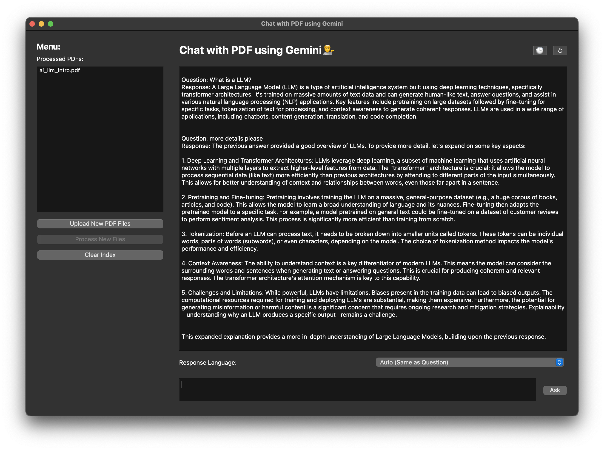

# PDF Chatbot with Google Gemini

This project implements a chatbot application that allows users to upload PDF documents, process them, and then ask questions about their content using Google Gemini's powerful language model.  The application provides a user-friendly interface built with PyQt6 for interacting with the model and viewing the results.

## Features

- PDF Upload and Processing: Upload multiple PDF files and process them to create a searchable index.
- Google Gemini Integration:  Leverages Google Gemini's powerful language model for accurate and context-aware answers.
- Conversational History: Maintains a history of questions and answers for context-aware responses.
- Language Detection: Automatically detects the language of the question and allows users to specify the response language.
- User-Friendly Interface:  Provides an intuitive PyQt6-based graphical user interface.
- Index Management: Allows users to clear the existing index and process new PDF files.


## Installation

1.  Clone the repository:
    ```bash
    git clone <repository_url>
    ```
2.  Create a virtual environment (recommended):
    ```bash
    python3 -m venv .venv
    source .venv/bin/activate  # On Windows: .venv\Scripts\activate
    ```
3.  Install dependencies:
    ```bash
    pip install -r requirements.txt
    ```
4.  Set up environment variables: Create a `.env` file in the root directory and add your Google Cloud API key:
    ```
    API_KEY=<your_google_cloud_api_key>
    ```


## Usage

1.  Run the application:
    ```bash
    python src/app.py
    ```
2.  Click "Upload New PDF Files" to select PDF files.
3.  Click "Process New Files" to create the index.  This may take some time depending on the size of the PDFs.
4.  Type your question in the text box and click "Ask" or press Enter.
5.  View the response in the chat history.
6.  Use the "Clear Index" button to start over with a new set of PDFs.
7.  Use the "↺" button to clear the current chat history.
8.  Use the "🕒" button to view the question history.


## Project Structure

- [src/](./src): Contains the source code:
  -   [src/utils.py](./src/utils.py): Contains utility functions for text processing, language detection, and index management.  
  -   [src/app.py](./src/app.py): Contains the main application logic and the PyQt6 GUI. 
-    [data/](./data): Contains data files:
     -   [data/ai_llm_intro.pdf](./data/ai_llm_intro.pdf):  A sample PDF document containing information about Large Language Models (LLMs).  This is used for testing and demonstration purposes.
     -   [data/index_info.json](./data/index_info.json): A JSON file that stores metadata about the processed PDF files, including filenames.
     -   [data/question_history.txt](./data/question_history.txt): A text file that stores the history of questions asked by the user.
     -    [data/faiss_index/](./data/faiss_index/): Contains the FAISS index files, which contains the embeddings of the text chunks extracted from the processed PDF files.
          -   [data/faiss_index/index.faiss](./data/faiss_index/index.faiss): The FAISS index file. 
          -   [data/faiss_index/index.pkl](./data/faiss_index/index.pkl): A pickle file containing the index data. 
-   [image/](./image): Contains screenshots of the application.


## Screenshots

This screenshot shows the main application window with the upload, process, and clear buttons, along with the chat interface and language selection.



This screenshot shows the question history dialog, allowing users to review past questions and answers.

<div style="text-align: center;">
    
</div>

